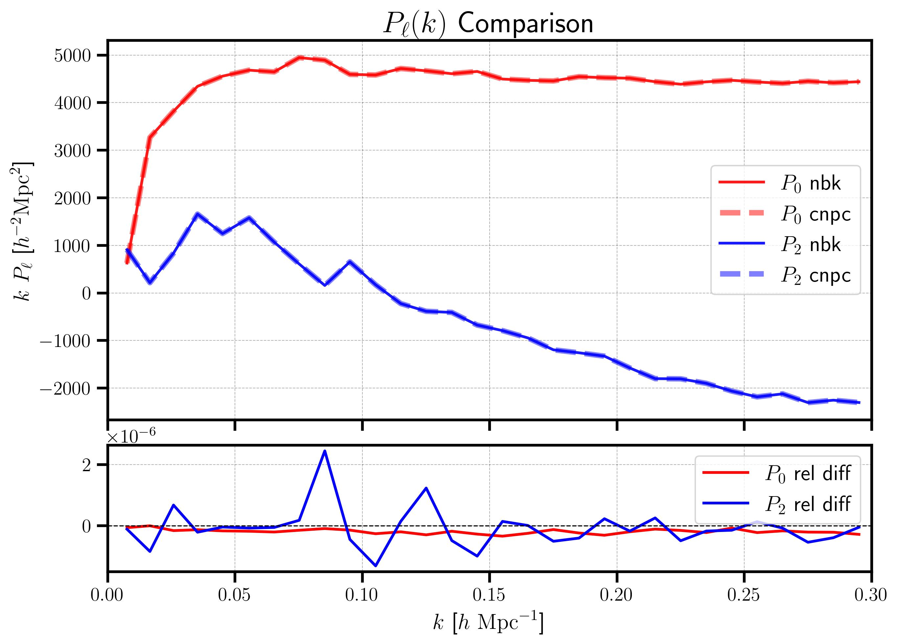
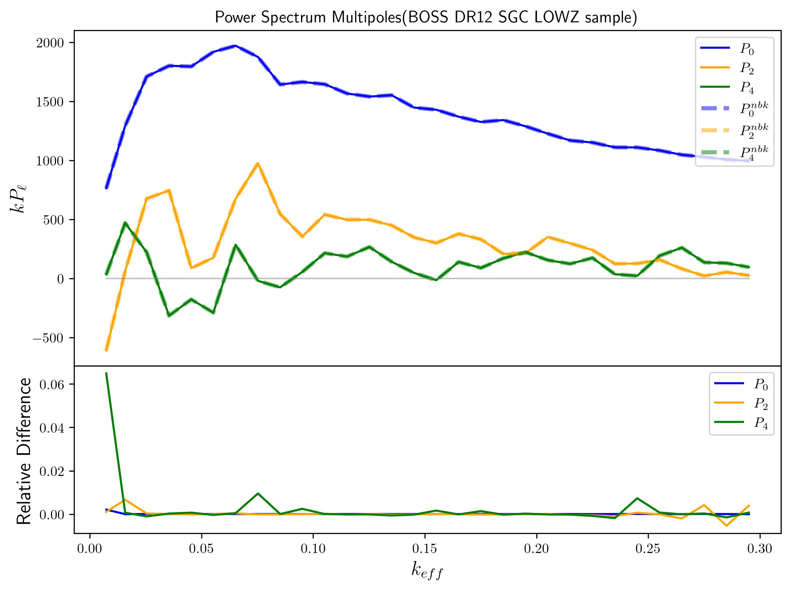
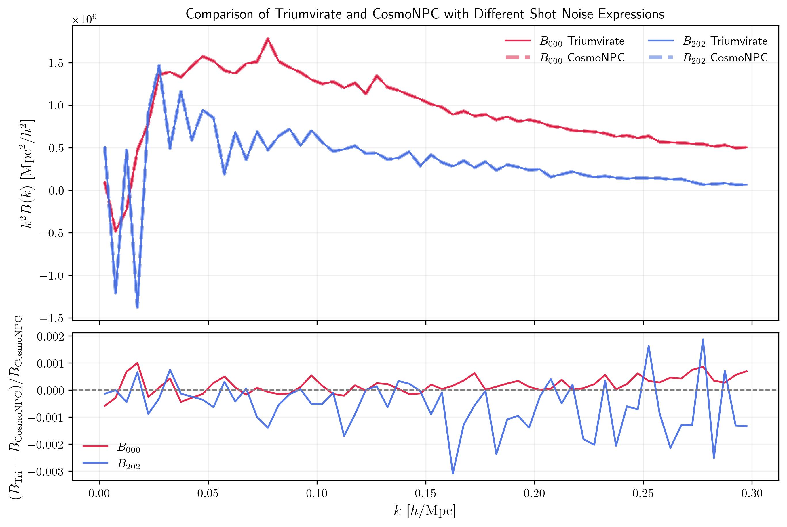
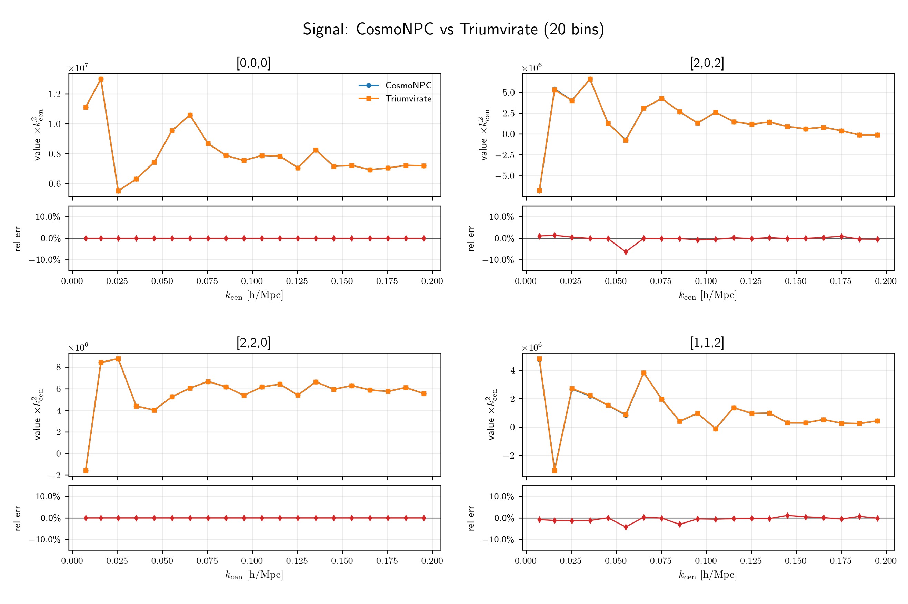
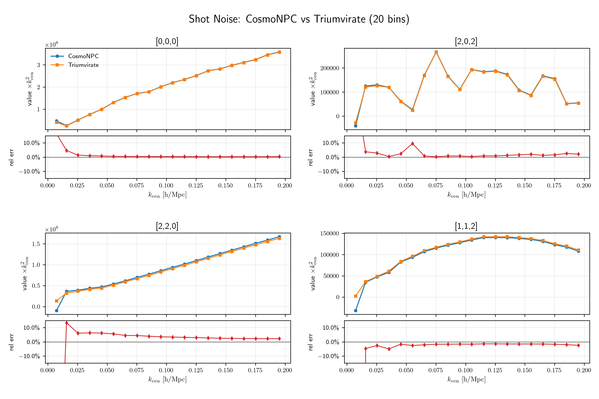
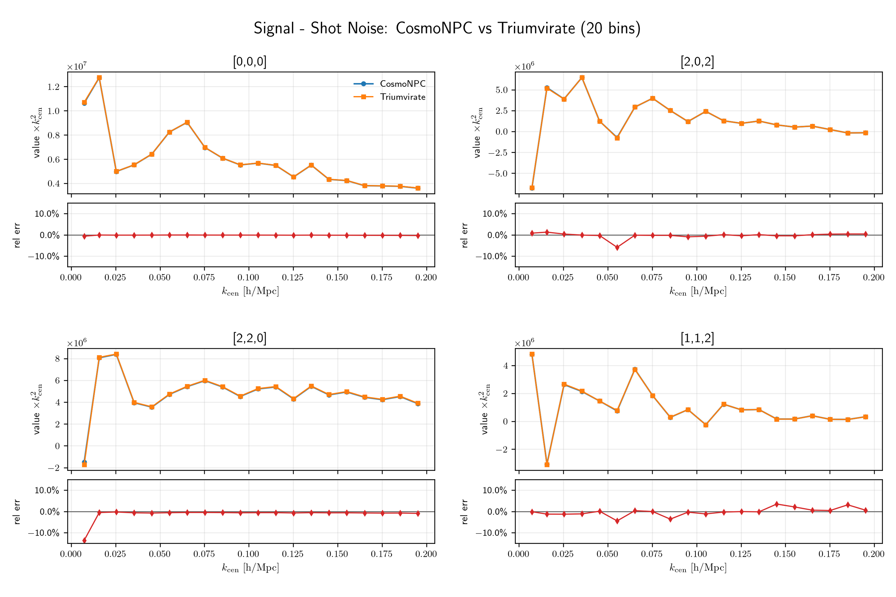

# Result Comparison Notes

This directory collects comparison plots between CosmoNPC and other large-scale structure measurement codes, including [nbodykit](https://nbodykit.readthedocs.io/en/latest/) and [Triumvirate](https://github.com/MikeSWang/Triumvirate/tree/main). The main purpose of this material is to document numerical consistency checks for both power spectrum and bispectrum measurements in box-like and survey-like settings.

## Power Spectrum (with nbodykit)

### Box-like

Catalog: [molino.z0.0.fiducial.nbody1.hod0.fits](https://changhoonhahn.github.io/molino/current/)

### Survey-like

Catalog: [galaxy_DR12v5_LOWZ_South.fits and random0_DR12v5_LOWZ_South.fits](https://data.sdss.org/sas/dr12/boss/lss/)

## Bispectrum (with Triumvirate)

### Box-like

Catalog: [abacus_HF_ELG_0p950_DR2_v2.0_AbacusSummit_base_c000_ph000_base_conf_nfwexp_clustering.dat.h5](https://abacussummit.readthedocs.io/en/latest/data-products.html)

### Survey-like

Catalog: [galaxy_DR12v5_LOWZ_South.fits and random0_DR12v5_LOWZ_South.fits](https://data.sdss.org/sas/dr12/boss/lss/)

Note: the differences mainly come from two sources:

1. The spherical harmonics of the line of sight are applied to catalogs in Triumvirate, but to mesh fields in CosmoNPC.
2. The two codes use different thin-shell approximations for $\left.S_{\ell_1 \ell_2 L}\right|_{i=j \neq k}\left(k_1, k_2\right)$.

